    

<h1 align="center">Hi, I'm Mohammad Abubakar 👋</h1>

  Full-Stack Developer · .NET • Node.js • React/Next.js
   
  Clean, scalable apps with strong UX. Open to remote roles & collabs.

  <a href="https://portfolio-opal-psi-28.vercel.app/">Portfolio</a> •
  <a href="https://www.linkedin.com/in/mohammad-abubakar-099aa122a/">LinkedIn</a> •
  <a href="mailto:moabubakar230@gmail.com">Email</a>

---

### About
- Building production-ready web apps and APIs (.NET, Node, React/Next).
- Interested in dashboards, auth, payments, and performance.
- Currently polishing my Next.js project - A drag and drop, portfolio builder (website/web app builder).

### Tech

  
  
  
  
  
  
  
  
  
  
  
  

### Featured Projects
- **Portfolio Theme (React + Chakra UI)** — Clean, responsive portfolio with modals & gallery.  
  _Demo:_ https://portfolio-opal-psi-28.vercel.app/
- **API & Auth Examples** — NextAuth (Google/Magic Links), Prisma, Postgres.  
  _Code:_ (link repo)
- **Dashboard UI** — ShadCN/Tailwind components with charts & skeleton loading.  
  _Code:_ (link repo)

### Stats

  
  

  

